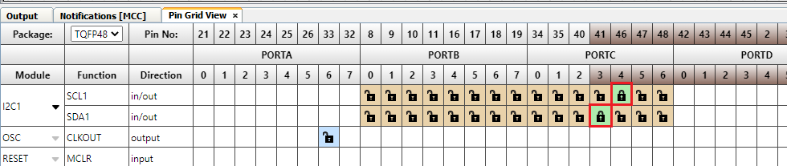
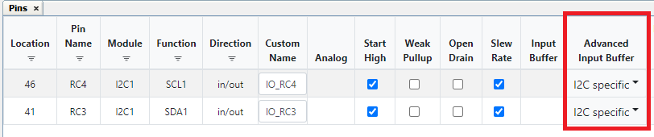

<!-- Please do not change this logo with link -->

[](https://www.microchip.com)

# Multi-Voltage I/O (MVIO) Example Using I2C to communicate with EEPROM 3 Click board using the PIC18F56Q24 Microcontroller Generated with MCC Melody

<!-- This is where the introduction to the example goes, including mentioning the peripherals used -->
This example shows how to use MVIO for two different voltage domains, one voltage for the Microcontroller and a different one for the Sensor or in this example an EEPROM using I<sup>2</sup>C communication.
## Related Documentation

- [PIC18F-Q24 Family Product Page](https://www.microchip.com/en-us/product/PIC18F56Q24#Overview)

## Software Used

- [MPLAB® X IDE](http://www.microchip.com/mplab/mplab-x-ide) v6.15 or newer
- [MPLAB® XC8](http://www.microchip.com/mplab/compilers) v2.45 or newer
- [PIC18F-Q_DFP Series Device Pack](https://packs.download.microchip.com) v1.23.425 or newer
- [MPLAB® Code Configurator](https://www.microchip.com/en-us/tools-resources/configure/mplab-code-configurator) 5.5.7 or newer
- [MPLAB® Code Configurator Melody](https://www.microchip.com/en-us/tools-resources/configure/mplab-code-configurator/melody) core 2.6.2 or newer


## Hardware Used
- [PIC18F56Q24 Curiosity Nano](https://www.microchip.com/en-us/development-tools-tools-and-software/development-tools-category-explorer?category=curiosityboards&subcategory=8-bit-curiosity-nano-boards) Development Board is used as a test platform.

<br>

- [EEPROM 3 Click](https://www.mikroe.com/eeprom-3-click) from MIKROE 

<br>

## Prerequisites

For MVIO to work together with the Curiosity Nano board, disconnect the R201 resistor connecting V<sub>DDIO2</sub> to VCC_TARGET.

<br>

A power supply must be connected to the V<sub>DDIO2</sub> pin. There are two possible use cases:
<br />
**a.** Connecting an external DC power supply to the V<sub>DDIO2</sub> pin and GND.
<br />
**b.** Using Curiosity Nano, use V<sub>BUS</sub> as power supply, simply by connecting a wire between V<sub>BUS</sub> and V<sub>DDIO2</sub>.

I2C Connections
<br><br>

## Initial Setup

1. In the project resources window: check the dropdown box for **System** =>  click clock control.
   
<br>

 2. In the clock control window: go to the easy view tab, and set **Clock Settings** to **HFINTOSC**
  - Clock Source: HFINTOSC
  - Internal Clock: 4 MHz
  - Clock Divider: 4

<br>

3. In the project resources window: check the dropdown box for **System** =>  click configuration bits.
   
<br>

 4. In the configuration bits window: go to the easy view tab, and use Drop down boxes to set the **External Oscillator Selection** to **Oscillator not enabled** & **Reset Oscillator Selection** to **HFINTOSC w HFFRQ = 4 MHz and CDIV = 4:1**
  - External Oscillator: Disabled
  - Reset Oscillator: 4 MHz & Clock Divider 4:1

<br>

5. In the project resources window: check the dropdown box for **System** => check the dropdown box for **MVIO** click VDDIO2.

<br>

These are the settings for this example. 
- I/O Monitor: Enable
- Hysteresis: Enable
- LVD Trip Point: Disabled

<br>

## Setup

1. Under Device Resources in left-hand pane:
   1. Open the **Drivers** drop-down
   2. Click the green plus sign next to **I2C_Host** peripheral to add them your project.

<br>

In the project resources window: Click the dropdown box for Drivers => I2C => click **I2C1_Host**

<br>

In the I2C_Host window: go to the easy view tab, and use the dropdown box to select **I2C1**

<br>

This is what the window will change to after making this setting

<br>

In the Pin Grid View window: Click on RC4 for **SCL1** & RC3 for **SDA1** see below

<br>

In the project resources window: check the dropdown box for **System** => Click **Pins**.

<br>

The Pins Tab shows up in MPLAB on the right side: use the drop down arrows to select Advanced Input Buffer settings to be **I2C** specific For SCL1 and I2C1

<br>
Code: main.c
```
#include "mcc_generated_files/system/system.h"
uint8_t buffer[10] = { 0 } ;
uint8_t ii =0x0;
uint8_t i =0x4;

void I2C_DummyWrite(void){
     
    I2C1ADB1=0b10101100; //Address Buffer, This is how we say hi
    I2C1CNT=2; // Byte Count if added gives extra byte
        
    I2C1TXB=0b00000001;
    I2C1CON0bits.S=1; // Sets I2C host Start Mode 
    
    while(!I2C1STAT1bits.TXBE);// Write address is sent into the TX buffer
    
    I2C1TXB=i;
    while(!I2C1STAT1bits.TXBE);   
}
    
void I2C_Read(void){
    
    
    I2C1ADB1=0b10101101;
    I2C1CNT=1;
    I2C1CON0bits.S=1; 
    while(!I2C1STAT1bits.RXBF);//
    buffer[9]=I2C1RXB;  
}

int main(void)
{
    SYSTEM_Initialize();
    //I2C1_Initialize();
    //registers for I2C control
    
    //for Pins RC3
    
    RC3I2Cbits.SLEW=0b01; //Slew Control Register
    RC3I2Cbits.TH=0b01; //Input Threshold
    
    //for Pins RC4
    
    RC4I2Cbits.SLEW=0b01;   //Slew Control Register
    RC4I2Cbits.TH=0b01;   //Input Threshold
    
    I2C1CON0bits.MODE=0b100;  //Sets the peripheral for I2C control     
    
    I2C1CON2bits.SDAHT=0b10; // Data hold time 3ns
    I2C1CON2bits.BFRET=00; //8 I2CxCLK        
    
    I2C1CON3bits.FME=1; // Fast mode Enabled
    
            
    I2C1CLKbits.CLK=0b00000; //Clock as Fosc/4
    
    I2C1BAUD = 0x27; //sets baud rate at 39
    I2C1CON0bits.EN=1;  // Enables the I2C Modules 
            I2C_DummyWrite();  
            __delay_ms(50);
            I2C_Read();
        
    while(1)
    {       
    }
}      
```
<!-- Explain how to connect hardware and set up software. Depending on complexity, step-by-step instructions and/or tables and/or images can be used -->

## Operation
The example code sends a write command using I2C to write data to the EEPROM3 Click board delays for 50ms and then initiates a I2C read command to read from the EEPROM3 Click board.
<!-- Explain how to operate the example. Depending on complexity, step-by-step instructions and/or tables and/or images can be used -->

## Summary

<!-- Summarize what the example has shown -->
