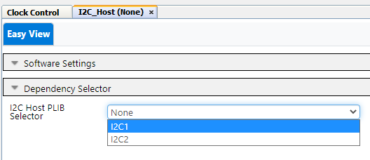

<!-- Please do not change this logo with link -->

[](https://www.microchip.com)

# Multi-Voltage I/O (MVIO) Example Using I2C to Communicate with an EEPROM 3 Click board and MCP9800 Using the PIC18F56Q24 Microcontroller Generated with MCC Melody

<!-- This is where the introduction to the example goes, including mentioning the peripherals used -->
This example shows how to use the Multi-Voltage I/O (MVIO) for two different voltage domains, one voltage for the Microcontroller and a different one for the Sensor or in this example an EEPROM using the I<sup>2</sup>C communication. This example communicates with an MC9800 Temperature Sensor and saves the data to the EEPROM 3 Click board®.
## Related Documentation

- [PIC18F-Q24 Family Product Page](https://www.microchip.com/en-us/product/PIC18F56Q24)
- [PIC18F56Q24 Data Sheet](https://www.microchip.com/DS40002503)
## Software Used

- [MPLAB® X IDE](http://www.microchip.com/mplab/mplab-x-ide) v6.15 or newer
- [MPLAB XC8](http://www.microchip.com/mplab/compilers) v2.45 or newer
- [PIC18F-Q_DFP Series Device Pack](https://packs.download.microchip.com) v1.23.425 or newer
- [MPLAB Code Configurator](https://www.microchip.com/en-us/tools-resources/configure/mplab-code-configurator) 5.5.7 or newer
- [MPLAB Code Configurator Melody](https://www.microchip.com/en-us/tools-resources/configure/mplab-code-configurator/melody) core 2.6.2 or newer


## Hardware Used
- [PIC18F56Q24 Curiosity Nano](https://www.microchip.com/en-us/development-tools-tools-and-software/development-tools-category-explorer?category=curiosityboards&subcategory=8-bit-curiosity-nano-boards) Base for Click boards® is used as a test platform

<br>

- [PICkit Serial I2C Demo Board](https://www.microchip.com/en-us/development-tool/PKSERIAL-I2C1) MCP9800 sensor on this board is used for the temperature sensor

<br>

- [EEPROM 3 Click](https://www.mikroe.com/eeprom-3-click) from MIKROE

<br>

- [Saleae Logic Analyzer](https://www.saleae.com/)

## Prerequisites

For the MVIO to work together with the Curiosity Nano board, disconnect the R201 resistor connecting V<sub>DDIO2</sub> to VCC_TARGET.

<br>

A power supply must be connected to the V<sub>DDIO2</sub> pin. There are two possible use cases:
<br />
**a.** Connecting an external DC power supply to the V<sub>DDIO2</sub> pin and GND.
<br />
**b.** Together with the Curiosity Nano, use the V<sub>BUS</sub> as power supply, by connecting a wire between the V<sub>BUS</sub> and the V<sub>DDIO2</sub>.

I2C Connections
- MCP9800 Temperature Sensor
<br><br>
- EEPROM 3 Click Board
<br><br>

## Initial Setup

1. In the **Project Resources** window: check the dropdown box for **System**, then click Clock Control.
   
<br>

 2. In the Clock Control window: go to the **Easy View** tab, and set **Clock Settings** to **HFINTOSC**. 
  - Clock Source: HFINTOSC
  - Internal Clock: 4 MHz
  - Clock Divider: 4

<br>

3. In the **Project Resources** window: check the dropdown box for **System**, then  click Configuration Bits.
   
<br>

 4. In the Configuration Bits window: go to the **Easy View** tab, and use dropdown boxes to set the **External Oscillator Selection** to **Oscillator not enabled** & **Reset Oscillator Selection** to **HFINTOSC w HFFRQ = 4 MHz and CDIV = 4:1**
  - External Oscillator: Disabled
  - Reset Oscillator: 4 MHz & Clock Divider 4:1

<br>

5. In the **Project Resources** window: check the dropdown box for **System**, then check the dropdown box for **MVIO** click VDDIO2.

<br>

These are the settings for this example. 
- I/O Monitor: Enable
- Hysteresis: Enable
- LVD Trip Point: Disabled

<br>

## Setup

Under Device Resources in left-hand pane:
   1. Open the **Drivers** dropdown.
   2. Click the green plus sign next to **I2C_Host** peripheral to add them your project.

<br>

In the Project Resources window: Click the dropdown box for Drivers then I2C then click **I2C1_Host**.

<br>

In the I2C_Host window: go to the **Easy View** tab, and use the dropdown box to select **I2C1**.

<br>

This is what the window will change to after making this setting.

<br>
   1. Open the **Drivers** dropdown.
   2. Click the green plus sign next to **I2C_Host** peripheral to add them your project.

<br>

In the Project Resources window: Click the dropdown box for Drivers then I2C then click **I2C2_Host**.

<br>

In the I2C_Host window: go to the **Easy View** tab, verify the setting match the picture below.

<br>

In the Pin Grid View window: For I2C1 click on **RC4** for **SCL1** & **RC3** for **SDA1**. For I2C2 click on **RB1** for **SCL2** & **RB2** for **SDA2**. See below.


<br>

In the Project Resources window: check the dropdown box for **System** then click **Pins**.

<br>

The **Pins** Tab shows up in MPLAB on the right side: select Start High for all I<sup>2</sup>C pins.


<br>

Code: main.c
```
#include "mcc_generated_files/system/system.h"
#include "mcc_generated_files/i2c_host/i2c1.h"
#include "mcc_generated_files/i2c_host/i2c_host_event_types.h"
     
#define I2C1_CLIENT_ADDR                0b01010110
#define I2C1_REG_ADDR                   0x0102
#define I2C_CLIENT_ADDR                 0x49
#define MCP9800_REG_ADDR_CONFIG         0x01
#define MCP9800_REG_ADDR_TEMPERATURE    0x00
#define CONFIG_DATA_12BIT_RESOLUTION    0x60
#define I2C_RW_BIT                      0x01

void I2C_1ByteAddress(uint8_t address, uint8_t reg, uint8_t data);
void I2C_2_N_2(uint8_t address, uint16_t reg, uint16_t data);
uint16_t I2C1_randomRead2Byte(uint8_t address, uint16_t reg);
uint16_t I2C1_Read_1ByteAdd_2ByteData(uint8_t address, uint8_t reg);

/*
    Main application
*/

int main(void)
{
    uint16_t rawTempValue;
    uint16_t eepromReadValue;

    SYSTEM_Initialize();

    I2C_1ByteAddress(I2C_CLIENT_ADDR, MCP9800_REG_ADDR_CONFIG , CONFIG_DATA_12BIT_RESOLUTION);
    __delay_ms(2);
    rawTempValue = I2C1_Read_1ByteAdd_2ByteData(I2C_CLIENT_ADDR, MCP9800_REG_ADDR_TEMPERATURE);
    __delay_ms(5);
    I2C_2_N_2(I2C1_CLIENT_ADDR, I2C1_REG_ADDR, rawTempValue);
    __delay_ms(5);
    eepromReadValue = I2C1_randomRead2Byte(I2C1_CLIENT_ADDR,I2C1_REG_ADDR);

    while(1)
    {
    }   
}

void I2C_1ByteAddress(uint8_t address, uint8_t reg, uint8_t data){
   
    I2C2ADB1 = (uint8_t) (address<< 1);
    I2C2CNTL = 2; 
    I2C2TXB = reg;
    I2C2CON0bits.S=1; // Sets I2C host Start Mode   
    while(!I2C2STAT1bits.TXBE);// Write address is sent into the TX buffer
    I2C2TXB = data;
    while(!I2C1STAT1bits.TXBE);// Write address is sent into the TX buffer
   }

void I2C_2_N_2(uint8_t address, uint16_t reg, uint16_t data){
    uint8_t regLow = reg & 0xFF;
    uint8_t regHigh = reg >> 8;
    uint8_t dataLow = data & 0xFF;
    uint8_t dataHigh = data >> 8;
    
    I2C1ADB1 = (uint8_t) (address<< 1);
    I2C1TXB = regHigh;
    I2C1CNTL = 1; 
    I2C1CON0bits.S=1; // Sets I2C host Start Mode   
    while(!I2C1STAT1bits.TXBE);// Write address is sent into the TX buffer
    I2C1CNTL = 1; 
    I2C1TXB = regLow;
    while(!I2C1STAT1bits.TXBE);// Write address is sent into the TX buffer
    I2C1CNTL = 1;
    I2C1TXB = dataLow;
    while(!I2C1STAT1bits.TXBE);// Write address is sent into the TX buffer
    I2C1CNTL = 1;
    I2C1TXB = dataHigh;
   }

uint16_t I2C1_randomRead2Byte(uint8_t address, uint16_t reg){
    uint8_t regLow = reg & 0xFF;
    uint8_t regHigh = reg >> 8;
    uint8_t dataLow;
    uint16_t dataHigh;
    uint8_t data;
   
    I2C1ADB1 = (uint8_t) (address<< 1);
    I2C1TXB = regHigh;
    I2C1CNTL = 1; 
    I2C1CON0bits.S=1; // Sets I2C host Start Mode   
    while(!I2C1STAT1bits.TXBE);// Write address is sent into the TX buffer
    I2C1CNTL = 1; 
    I2C1TXB = regLow;
    I2C1CON0bits.RSEN = 1;
    I2C1CON0bits.S=1; // Sets I2C host Start Mode  
    while(!I2C1STAT1bits.TXBE);// Write address is sent into the TX buffer
    
    
    while(!I2C1CON0bits.MDR);//
    address = (uint8_t) (address<< 1);
    I2C1ADB1 = (uint8_t) (address | 1);
    I2C1CNTL = 2; 
    I2C1CON0bits.S=1; // Sets I2C host Start Mode  
    I2C1CON0bits.RSEN = 0;
    while(!I2C1STAT1bits.RXBF);
    dataLow = I2C1RXB; 
    I2C1CON0bits.S=1; // Sets I2C host Start Mode  
    while(!I2C1STAT1bits.RXBF);
    dataHigh = I2C1RXB;

    data = dataHigh << 8;
    data = data | dataLow;
    return data;
   }

uint16_t I2C1_Read_1ByteAdd_2ByteData(uint8_t address, uint8_t reg){
    uint8_t dataLow;
    uint8_t dataHigh;
    uint16_t data;

    I2C2ADB1 = (uint8_t) (address<< 1);
    I2C2TXB = reg;
    I2C2CNTL = 1; 
    I2C2CON0bits.S=1; // Sets I2C host Start Mode   
    while(!I2C2STAT1bits.TXBE);// Write address is sent into the TX buffer
    I2C2CON0bits.RSEN = 1;

    while(!I2C2CON0bits.MDR);//    

    address = (uint8_t) (address<< 1);
    I2C2ADB1 = (uint8_t) (address | 1);
    I2C2CNTL = 2; 
    I2C2CON0bits.S=1; // Sets I2C host Start Mode  
    I2C2CON0bits.RSEN = 0;
    while(!I2C2STAT1bits.RXBF);
    dataLow = I2C2RXB;
    I2C2CON0bits.S=1; // Sets I2C host Start Mode  
    while(!I2C2STAT1bits.RXBF);
    dataHigh = I2C2RXB;        

    data = dataHigh << 8;
    data = data | dataLow;
    return data;
   }
```


## Operation
The example code starts with an I<sup>2</sup>C command to configure the MPC9800 then sends an I<sup>2</sup>C command to read the temperature Sensor. The 3rd step sends an I<sup>2</sup>C command to write the data to the EEPROM3 Click board delays for 5 ms and then sends an I<sup>2</sup>C command to read from the EEPROM3 Click board. The MVIO is converting 5V to 3.3V and 3.3V to 5V when communicating with the EEPROM 3 Click board.

Saleae. Capture of the I<sup>2</sup>C transactions

 - MCP9800 I<sup>2</sup>C Command for Configuration of Temperature Sensor
 <br><br>
 - MCP9800 I<sup>2</sup>C Read Command for Temperature Sensor
<br><br>
 - EEPROM 3 Click I<sup>2</sup>C Write command
<br><br>
 - EEPROM 3 Click I<sup>2</sup>C Read command
<br><br>

## Summary
After Programming the device the PIC18F56Q24 sends an I<sup>2</sup>C command to configure the temperature sensor and then sends a command to read the temperature sensor. Now the microcontroller sends the data received to the EEPROM via I<sup>2</sup>C during these commands the MVIO module converts the 3.3V signals on the I<sup>2</sup>C bus to 5V for the EEPROM and the same the other way 5V signal from the EEPROM is converted to 3.3V for the microcontroller to interpret. These voltage levels can be seen in the saleae traces above.

